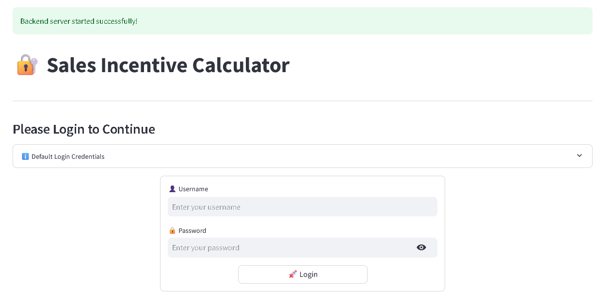
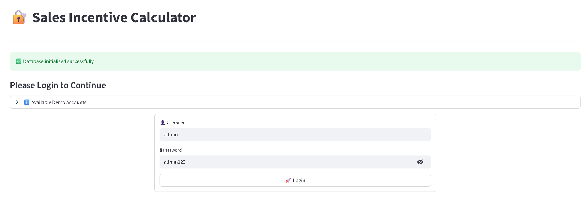
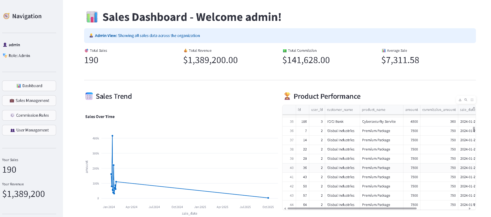
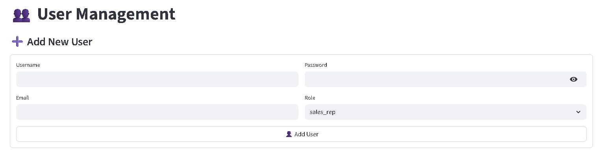
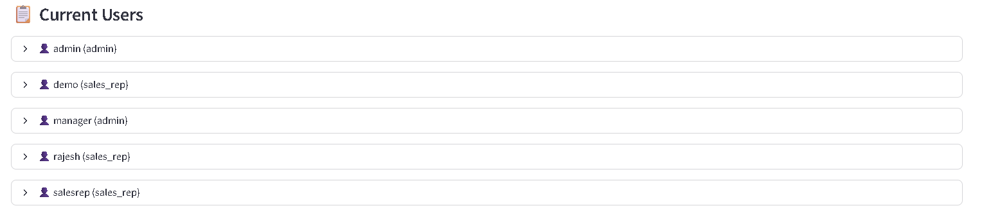
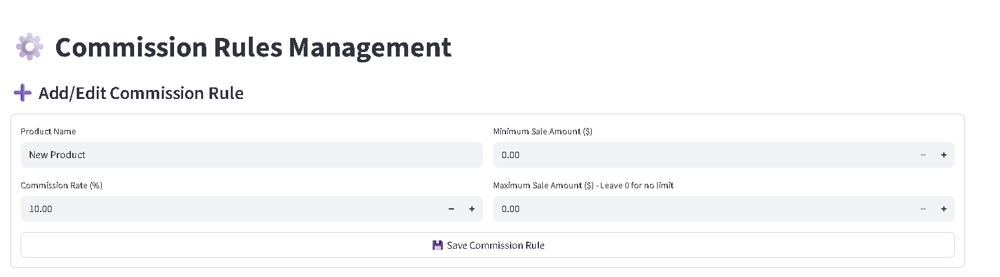
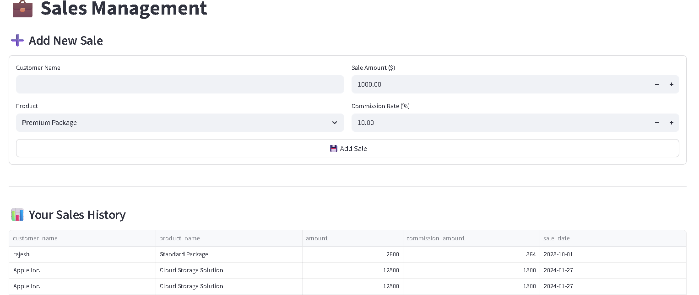

# 📊 Sales Incentive Calculator  

A comprehensive web application for managing sales teams, tracking commissions, and monitoring performance with **role-based access control**.  

---

## 🚀 Live Application  
👉 [Click Here to Access](http://100.90.199.148:8508)  

---

## 📋 Table of Contents  
1. [Getting Started](#1-getting-started)  
2. [Admin Login](#2-admin-login)  
3. [Dashboard Overview](#3-dashboard-overview)  
4. [User Management](#4-user-management)  
5. [Commission Rules](#5-commission-rules)  
6. [Sales Management](#6-sales-management)  
7. [Sales Rep Experience](#7-sales-rep-experience)  
8. [Features Summary](#8-features-summary)  

---

## 1. Getting Started  

  

### Demo Accounts  
- 👑 **Admin**: `admin` / `admin123` (Full system access)  
- 🛠 **Manager**: `manager` / `manager123` (Admin privileges)  
- 👨‍💼 **Sales Rep**: `salesrep` / `sales123` (Personal sales only)  
- 👨‍💼 **Demo Rep**: `demo` / `demo123` (Sample data included)  

---

## 2. Admin Login  

1. Enter `admin` as username and `admin123` as password  
2. Click **🚀 Login**  
3. Redirected to the **Admin Dashboard**  

  

---

## 3. Dashboard Overview  

**Admin Dashboard Features:**  
- 📊 Total sales, revenue, commission metrics  
- 📈 Sales trend charts  
- 🏆 Product performance (pie chart)  
- 📋 Recent sales records  

  

---

## 4. User Management  

- 👥 Create new sales representatives  
- ✏️ Manage existing users (edit/delete)  
- 🔑 Assign roles: `admin` or `sales_rep`  

  
  

---

## 5. Commission Rules  

- ⚙️ Define commission rates for each product  
- 🏷️ Example rules:  
  - Premium Package → **10%**  
  - Standard Package → **8%**  
  - Basic Package → **5%**  
  - Enterprise Solution → **12% (min $10,000)**  

  

---

## 6. Sales Management  

- 💼 Add sales records (customer name, product, amount)  
- 💵 Commission auto-calculated based on rules  
- 🗂️ View all sales history  

  

---

## 7. Sales Rep Experience  

- 👨‍💼 Sales reps log in with personal credentials  
- 📊 View **only their own performance**  
- 💼 Add new sales and track commission earnings  

---

## 8. Features Summary  

✅ **Role-based access control** (Admin, Manager, Sales Rep)  
✅ **Commission auto-calculation**  
✅ **Interactive charts and analytics**  
✅ **User-friendly sales management**  
✅ **Scalable for multiple sales teams**  

---

## 📞 Support  
For any issues, visit the project repository:  
👉 [GitHub Repository](https://github.com/Rahul554-commits/-Sales-Incentive-Commission-Calculator)  
