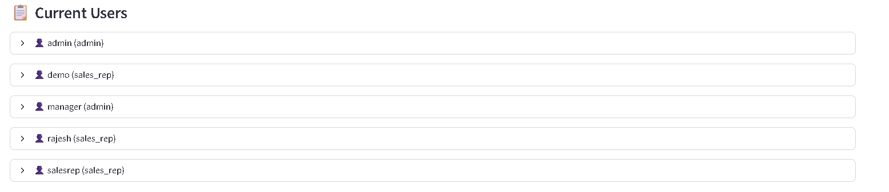

# 📊 Sales Incentive Calculator 

A comprehensive web application for managing sales teams, tracking commissions, and monitoring performance with role-based access control.

🚀 **Live Application:**  
[https://rahul554-commits--sales-incentive-commissio-complete-app-d0i75f.streamlit.app/]

---

## 📋 Table of Contents

1. [Getting Started](#getting-started)
2. [Admin Login](#admin-login)
3. [Dashboard Overview](#dashboard-overview)
4. [User Management](#user-management)
5. [Commission Rules](#commission-rules)
6. [Sales Management](#sales-management)
7. [Sales Rep Experience](#sales-rep-experience)
8. [Features Summary](#features-summary)
9. [Support & Next Steps](#support--next-steps)

---

## 1. Getting Started

Access the Application:  
[https://rahul554-commits--sales-incentive-commissio-complete-app-d0i75f.streamlit.app/]

**Login Page Features:**
- Clean, professional login interface
- Demo account information displayed
- Secure authentication system
- Role-based access control

**Demo Accounts Available:**
- Admin: `admin` / `admin123` (Full system access)
- Manager: `manager` / `manager123` (Admin privileges)
- Sales Rep: `demo` / `demo123` (Personal sales only)
- Sales Rep: `salesrep` / `sales123` (Personal sales only)

---

## 2. Admin Login

**Step 1: Login as Administrator**

- Enter Username: `admin`
- Enter Password: `admin123`
- Click “🚀 Login”

**Admin Dashboard Features:**
- Welcome message with role identification
- Full navigation sidebar with all admin features
- Real-time sales metrics display
- Interactive charts and analytics

---

## 3. Dashboard Overview

**Admin Dashboard Features:**
- 📊 Total Sales Count: Number of sales across all users
- 💰 Total Revenue: Sum of all sales amounts
- 💵 Total Commission: Commission earned by all salespeople
- 📈 Sales Trends: Interactive line chart showing sales over time
- 🏆 Product Performance: Pie chart of sales by product type

Key Metrics Displayed:
- Real-time sales data across all team members
- Interactive charts with hover details
- Recent sales table with complete transaction history
- Performance analytics and trend visualization

---

## 4. User Management

**Step 1: Navigate to User Management**

Click “👥 User Management” in the sidebar.

**User Management Interface:**
- Add new user form with validation
- Complete user list with statistics
- Role assignment (Admin or Sales Rep)
- User deletion capabilities

**Step 2: Add New Users (Repeat for each salesperson)**

Fill out the form:
- Username: `salesperson1` (increment for each user)
- Email: `salesperson1@company.com`
- Password: `sales2024`
- Role: Select `sales_rep`
- Click “👤 Add User”

**User List Features:**
- Complete user directory with contact information
- Individual sales statistics per user
- Creation date tracking
- Management actions (delete users)

---

## 5. Commission Rules

**Step 1: Navigate to Commission Rules**

Click “⚙️ Commission Rules” in the sidebar.

**Commission Rules Interface:**
- Add new commission rule form
- Existing rules table with edit/delete options
- Flexible rate configuration
- Minimum and maximum amount settings

**Step 2: Add Commission Rules**

| Product              | Commission Rate | Min Amount | Max Amount  |
|----------------------|----------------|------------|-------------|
| Premium Package      | 10%            | $0         | No Limit    |
| Standard Package     | 8%             | $0         | No Limit    |
| Basic Package        | 5%             | $0         | No Limit    |
| Enterprise Solution  | 12%            | $10,000    | No Limit    |

---

## 6. Sales Management

**Step 1: Navigate to Sales Management**

Click “💼 Sales Management” in the sidebar.

**Sales Management Interface:**
- Add new sale form with validation
- Sales history table with filtering
- Automatic commission calculation
- Customer and product tracking

**Step 2: Add New Sale**

Fill out the sales form:
- Customer Name: “ABC Corporation”
- Product: Select from dropdown
- Sale Amount: `$5,000.00`
- Commission Rate: `10%` (auto-filled)
- Click “💾 Add Sale”

---

## 7. Sales Rep Experience

**Step 1: Sales Rep Login**

- Username: `salesperson1`
- Password: `sales2024`

**Sales Rep Dashboard Features:**
- Personal metrics and performance data
- Individual sales history
- Commission earnings tracking
- Restricted access to personal data only

<!-- You may add a screenshot here if you have one for the sales rep dashboard,
e.g.,  -->

---

## 8. Features Summary

| Feature            | Admin Access      | Sales Rep Access  | Description                       |
|--------------------|------------------|-------------------|-----------------------------------|
| Dashboard          | All sales data    | Personal data     | Metrics, charts, trends           |
| Sales Management   | View all + Add    | Personal only     | Add/view sales records            |
| Commission Rules   | Full control      | View only         | Set commission rates              |
| User Management    | Full control      | No access         | Add/delete users                  |
| Role-Based Security| ✅                | ✅                | Secure access control             |

---

## 📞 Support & Next Steps

### Support

For **help and troubleshooting**, please create an issue in this repository or email the maintainer.  
For **live support**, contact the admin through the application's support section.

**Recommended Enhancements:**
- Bulk User Import (CSV)
- Sales Reports Export (PDF/Excel)
- Sales Target Tracking

### Technical Details

- **Built with:** Streamlit, SQLite, Plotly, Pandas
- **Database:** Automatically initialized with sample data
- **Security:** Password-based authentication with role management
- **Performance:** Real-time data updates & interactive charts

---

## 🚀 Quick Start Checklist

- [ ] 1. Access application at [http://100.90.199.148:8508](http://100.90.199.148:8508)
- [ ] 2. Login as admin (`admin` / `admin123`)
- [ ] 3. Create 20 salespeople via User Management
- [ ] 4. Set up commission rules for your products
- [ ] 5. Test adding sales as admin
- [ ] 6. Login as salesperson and test their experience
- [ ] 7. Monitor team performance via admin dashboard

---
